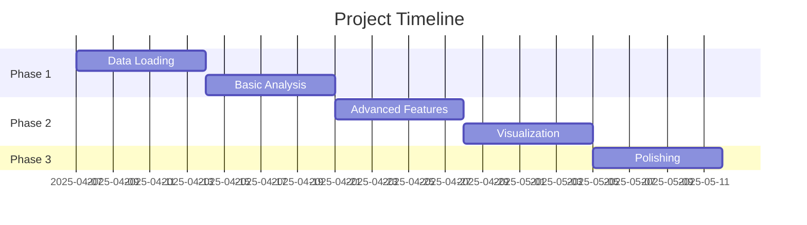

---

# **Personal Finance Analyzer - Final Project Prompt**

## **Project Overview**
You'll create a Python-based personal finance analyzer that processes transaction data (provided) to generate meaningful spending insights. Using a Google Colab notebook, you'll:

1. Import and clean transaction data
2. Perform financial calculations and analysis
3. Create visualizations
4. Generate actionable reports

**Dataset**: You'll work with 500+ simulated transactions (CSV format) covering bills, groceries, dining, subscriptions, and online shopping.

## **Technical Requirements**
### **Core Functionality (60pts)**
- ✅ **Data Loading & Cleaning** (10pts)
  - Import CSV data into Pandas DataFrame
  - Handle missing/dirty data
- ✅ **Basic Analysis** (15pts)
  - Monthly spending totals
  - Category breakdowns
  - Highest/lowest spending days
- ✅ **Advanced Features** (20pts)
  - Monthly spending trends (line chart)
  - Category pie/bar charts
  - Custom filters (date ranges, categories)
- ✅ **Visualization** (15pts)
  - At least 3 matplotlib/seaborn plots
  - Clear labels and titles

### **Code Quality (20pts)**
- 🧩 Proper functions/modular code
- 📝 Clear comments/docstrings
- 🐛 Error handling for edge cases

### **Presentation (20pts)**
- 📊 Colab notebook with Markdown explanations
- 🔍 Clear takeaways from analysis
- ✨ Professional formatting

## **Suggested Timeline**


## **Grading Rubric**
| Category            | Excellent (A) | Good (B) | Satisfactory (C) | Needs Improvement (D/F) |
|---------------------|---------------|----------|------------------|-------------------------|
| **Functionality**   | All features + 1+ extra | All core features | Missing 1-2 key features | Incomplete/non-working |
| **Code Quality**    | Modular, PEP8 compliant | Some functions | Minimal organization | Poor structure |
| **Visualizations**  | 3+ publication-quality | 3 clear plots | Basic charts | Missing/incomplete |
| **Insights**        | Actionable recommendations | Clear trends | Basic summaries | No meaningful analysis |

## **Submission Requirements**
1. Google Colab notebook (shared link)
2. 5 minute presentation
3. 1-page summary of key findings

**Due Date**: May 12 2025

---

### **Recommended Colab Structure**
```python
# [Student Name] - Finance Analyzer
"""## 1. Data Loading
## 2. Data Cleaning
## 3. Basic Analysis
## 4. Advanced Features
## 5. Visualization
## 6. Conclusions"""
```
